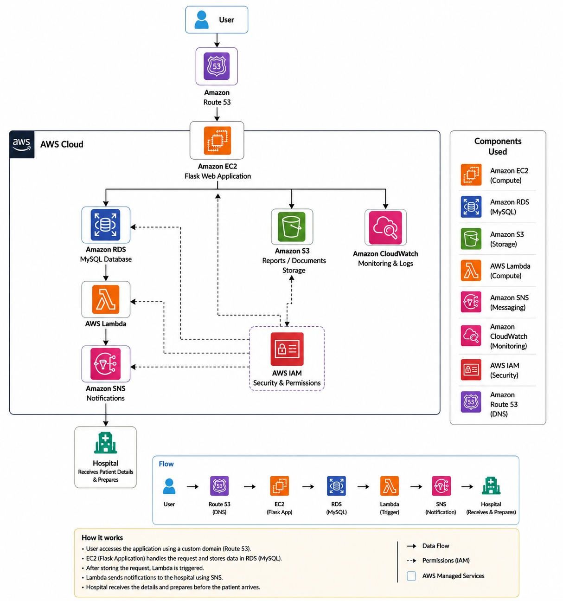
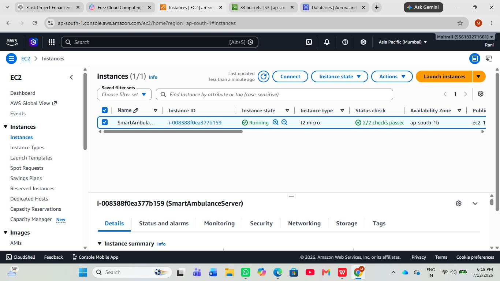
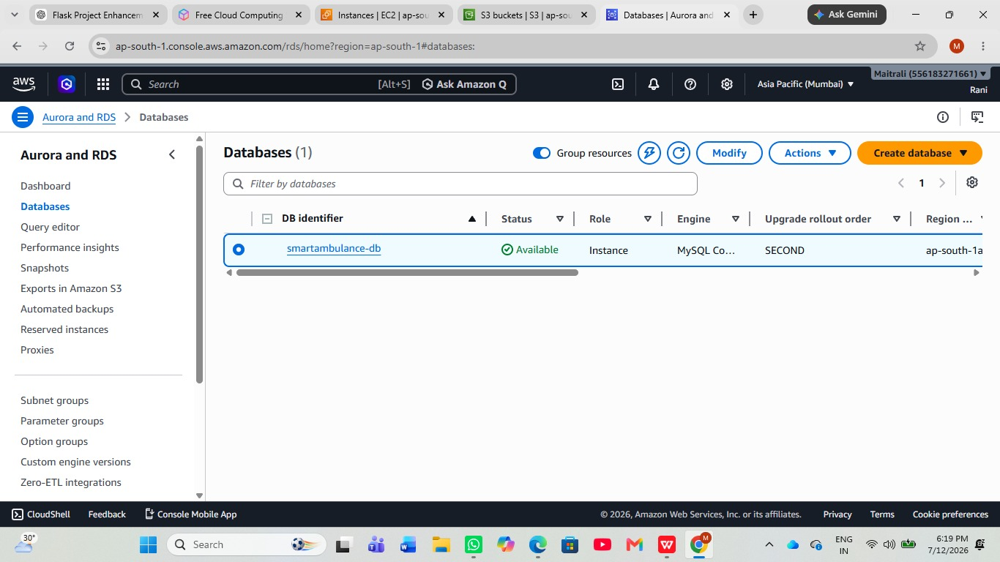
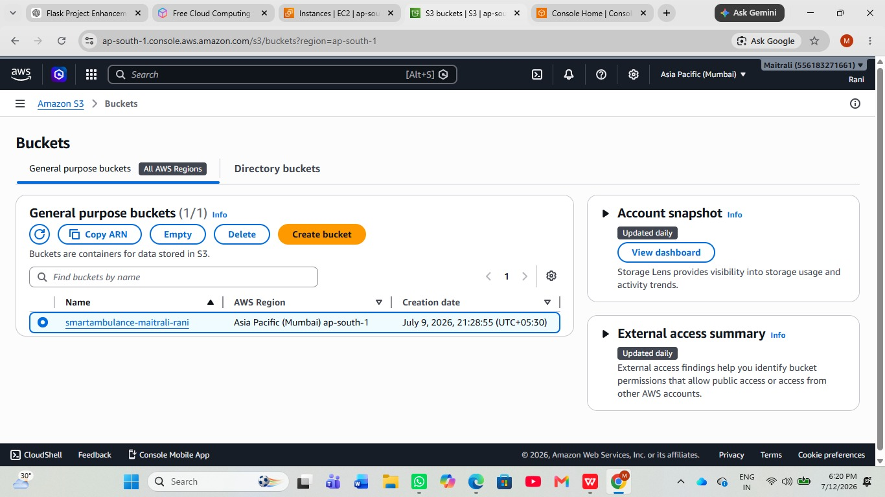
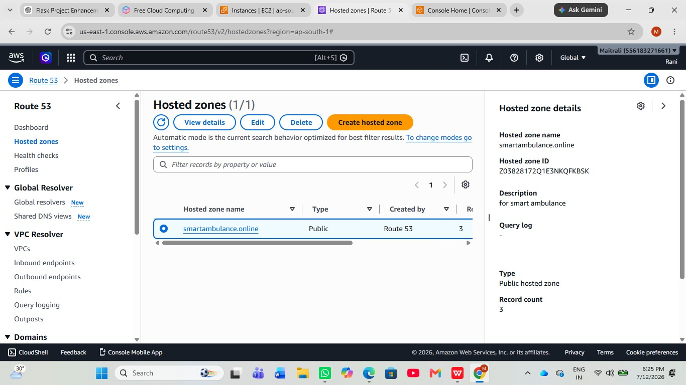
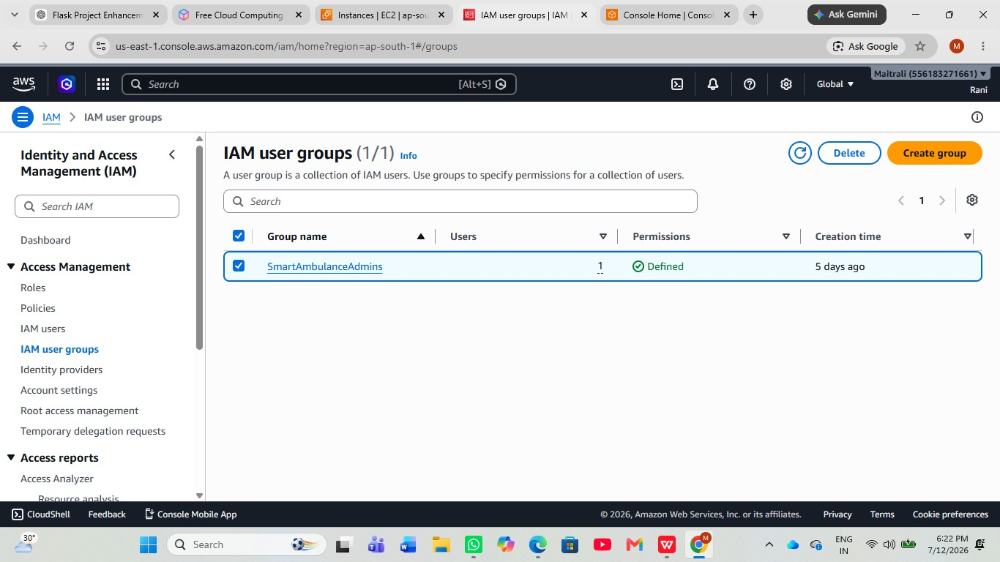
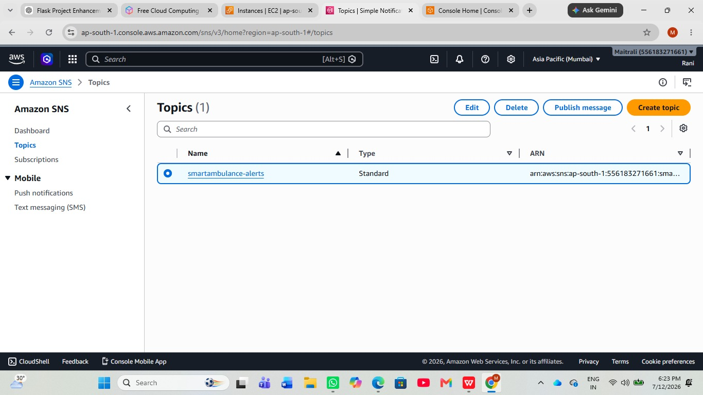
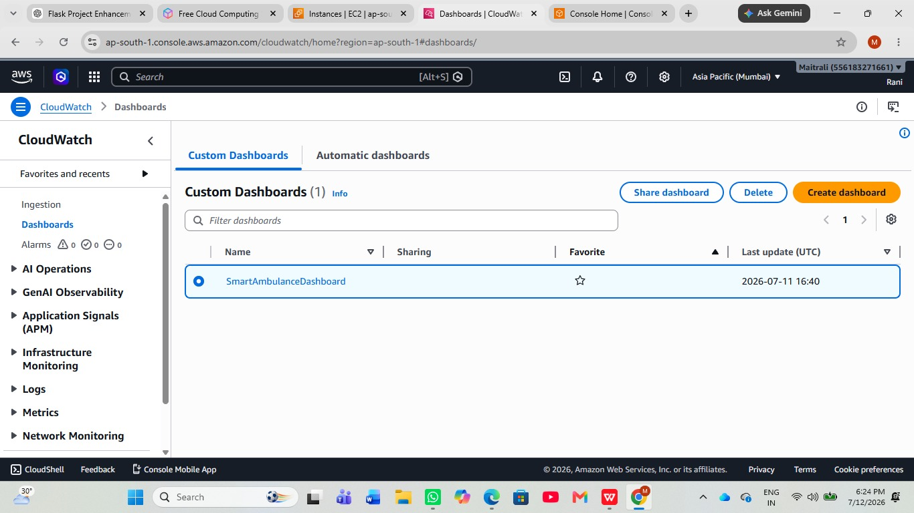
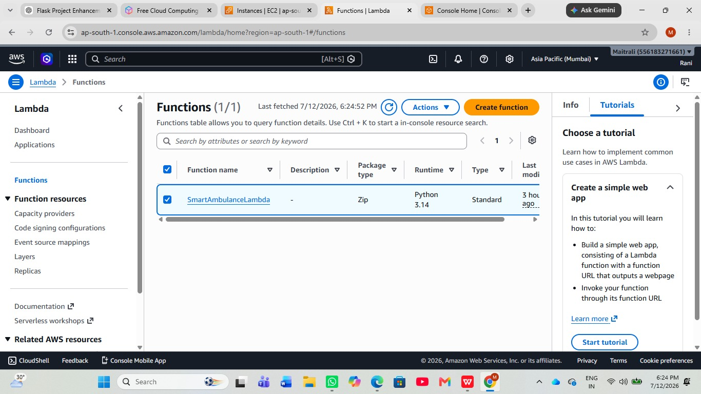
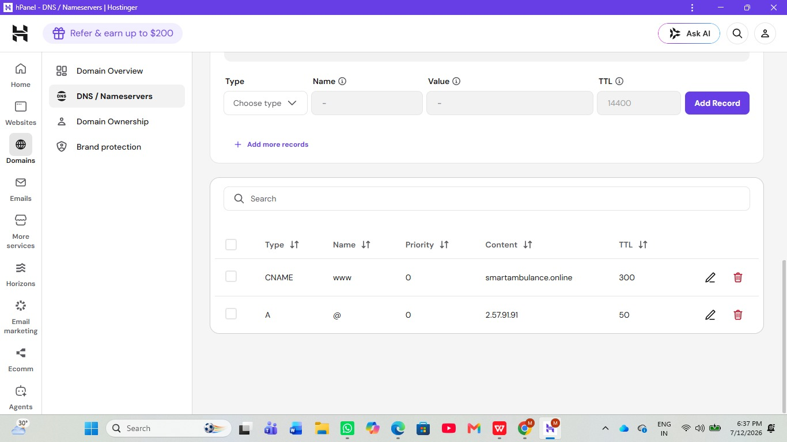

# Smart-Ambulance-System
project 

A cloud-based ambulance management system that helps users request ambulances quickly, enables hospitals to manage requests efficiently, and uses AWS cloud services for secure and scalable deployment.

 Features

- Ambulance Request
- Live Tracking
- Hospital Dashboard
- Emergency Notifications
- AWS Cloud Integration

Technologies Used

- HTML
- CSS
- JavaScript
- Python (Flask)
- AWS EC2
- Amazon S3
- Amazon SNS
- Amazon DynamoDB

AWS Architecture Overview

Amazon EC2
Amazon EC2 (Elastic Compute Cloud) is used to host the Smart Ambulance System application. It provides a scalable virtual server environment to run the web application efficiently.

Amazon RDS
Amazon RDS (Relational Database Service) is used to manage the application's database securely. It provides automated backups, high availability, and reliable data storage.

Amazon S3
Amazon S3 (Simple Storage Service) is used to store project-related images and static files securely with high durability and availability.

Amazon Route 53
Amazon Route 53 is used for DNS management and routing user requests to the deployed Smart Ambulance System.
Hosted Zone
A Hosted Zone is created in Route 53 to manage DNS records for the project's domain.

IAM User Group
AWS IAM User Groups are used to manage permissions and provide secure access control for project team members.

Amazon SNS
Amazon SNS (Simple Notification Service) is used to send notifications and alerts related to ambulance requests and system events.

Amazon CloudWatch
Amazon CloudWatch is used to monitor system performance, logs, and application health in real time.

AWS Lambda
AWS Lambda executes serverless functions automatically in response to application events, reducing infrastructure management.

Domain Configuration
A custom domain is configured using Amazon Route 53, allowing users to access the application through a user-friendly web address.

